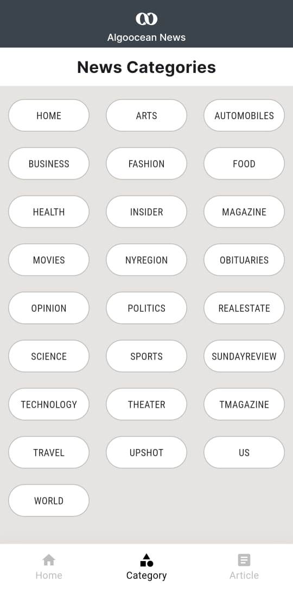

# algoocean_news

A Flutter application that fetches news articles from a public news API and presents them in a user-friendly interface.  
The app allows users to browse through different categories of news, view detailed articles, and experience smooth navigation with efficient API handling.

---

## 🚀 Features Implemented

- ✅ **API Integration** with (https://developer.nytimes.com/apis)
- ✅ Fetch **news articles by category** (Technology, Sports, Entertainment, etc.)
- ✅ **Home Screen** – list of News
- ✅ **Category Screen** – list of news articles in selected category
- ✅ **Article Screen** – detailed content with image & description
- ✅ **Pagination** – load more articles as user scrolls (Article Screen)
- ✅ **Pull-to-Refresh** on news list
- ✅ **Error Handling** – network/API errors handled gracefully with messages
- ✅ **Loading Indicators** while fetching data
- ✅ **State Management** – implemented using `Get-x`

---

## 📱 Screens

- **Home Screen** – All News
- **Category Screen** – browse articles in a category
- **Article Screen** – read full article

_(You can add screenshots here for better presentation)_  
Example:  
  
  

---

## 🛠️ How To Run Flutter App

**Step 1** : Enter a command "Flutter Clean" in Android Studio/Visual studio Terminal

**Step 2** : Enter a command "Flutter pub get" in Android Studio/Visual studio Terminal

**Step 3** : Enter a command "Flutter run"(Select the Device) in Android Studio/Visual studio Terminal
